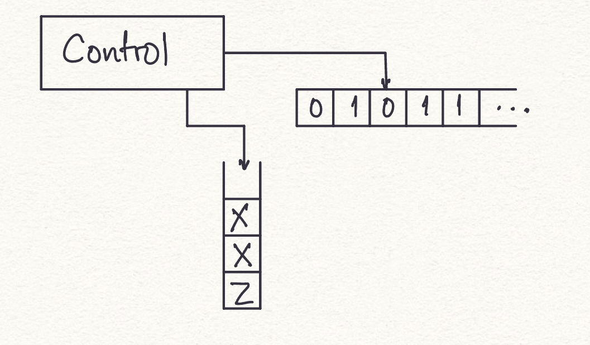
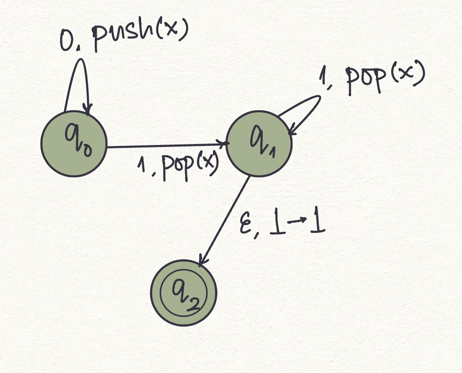
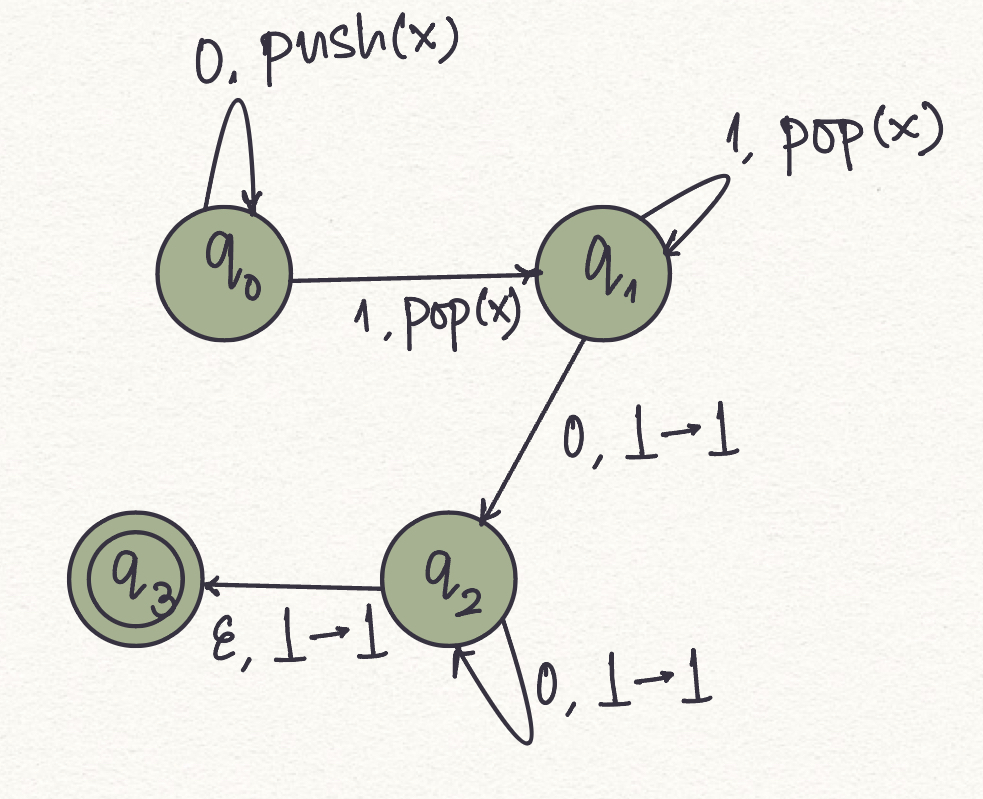

## Introduction

Before we start with this experiment, we recommend the reader gain an understanding of [Determininistic Finite Automata (DFA)](https://virtual-labs.github.io/exp-determinstic-finite-automaton-iiith/) and [Non-determininistic Finite Automata (DFA)](https://virtual-labs.github.io/exp-non-determinstic-finite-automaton-iiith/). 

> Question: Over the alphabet {0,1}, Is there a finite state automaton that recognizes the language defined by all strings with equal number of 1's and 0's. 

A basic observation is here, we need to keep track of the count of all the 1's and 0's that we have seen, or at least we need to keep track of the imbalance in the count of 1's and 0's that we have seen so far, as we parse the input string. It might seem a little counterintuitive after all the vending machine examples. Sure, we can simulate addition, but we cannot actually “count” entities. The vending machine idea is analogous to counting in a unary alphabet. That is if we had to only keep track of number of 1's that we encountered so far, that is doable. But to recognize the afore mentioned strings, we need something more. Recall that with finite state machines, there’s no associated memory at all, except for what’s available in “control” (current state). Further, there is no history of all the transitions made to reach the current state. It’s almost like a deterministic Markov chain (we have knowledge only of the exact previous state.)

So, how do we count? Could we possibly do this by using some memory? *<cue good old computer science style memory- stacks!>* Now this new machine, that is a finite state automaton equipped with a stack, is what we call a **pushdown automaton**. 

Pushdown automata is to context-free languages, what NFA’s and DFA’s are to regular languages: PDA’s recognise the languages generated by context-free grammars. Actually, only non-deterministic pushdown automata is truly equivalent in “accepting” power as is the generating power of context-free grammars.

### Formal definition
Now that we are familiar with the basics of pushdown automata, here is a formal definition.

A **Pushdown automata** (PDA for short) can be represented as a 6-tuple (Q, Σ, Γ, δ, q0, F ), where 

1. Q is the set of states
2. Σ is the input symbols
3. Γ is the stack alphabet/pushdown symbols
4. δ is the transition function that maps Q x {Σ ∪ ∈} x Γ into Q x Γ*
5. q_0 ∈ Q is the initial state 
6. F ⊆ Q is the set of final states.

Instantaneous Description shows how a PDA computes an input string and makes a decision to accept it or reject it. It is represented as a triple δ(q, w, α), where - 

1. q describes the current state
2. w describes the remaining input 
3. α describes the current contents of the stack

A move from one instantaneous description to another is denoted by the symbol ‘⊢’. This is known as the turnstile notation. 

## PDA and Context-Free Languages

> **Theorem:** A language is context-free if and only if there is a pushdown automaton that recognizes it.

This requires the following to be true:

1. If a language is context-free, then some PDA recognizes it. 
2. If a PDA recognizes a language, then the language is context-free.

## Examples

The following is a PDA for the language with the set of strings $\{0^n, 1^n| n>0\}$. Here Z (or alternatively $\perp$) denotes the empty stack and stack alphabet is $\{X\}$.

The logic involved in designing this PDA - 

1. $δ(q_0,0,Z)={(q_0,XZ)}$ - push an X onto the stack for the first 0 in the input.
2. $δ(q_0,0,X)={(q_0,XX)}$ - push an X onto the stack for each subsequent 0 in the input.
3. $δ(q_0,1,X)={(q_1,ϵ)}$ - at the first 1, go to state *p* and pop one *X.*
4. $δ(q_1,1,X)={(q_1,ϵ)}$ - Pop an *X* on each subsequent 1.
5. $δ(q_1,ϵ,Z)={(q_2,Z)}$ - Bottom of the stack.

Exercise 1: Design a pushdown automaton that accepts a language  { $0^m 1^m 0^n | m, n>=1$}.

The solution to this builds on the previous example. 

Exercise 2: $G = \{ w ∈ \{0, 1\}^∗ | w = w^R;   w = 2k+1,  k >= 0\}$.

    1. $Q = \{q_1, q_2, q_3, q_4\}$
    2. $\sum = \{0, 1\}$
    3. $\Gamma = \{0,1\}$
    4. table for the transition function
    5. q1 is the start state
    6. $F = \{q4\}$

 

 Exercise 3: $G = { a^i b^j c^k | i, j, k \geq 0; i + j = k\}$

    
    1. $Q = \{q_1, q_2, q_3, q_4, q_5\}$
    2. $\sum = \{a, b, c\}$
    3. $\Gamma = \{x, \$\}$
    4. table for the transition function
    5. q1 is the start state
    6. $F = \{q5\}$

    

# Recap 

1.  What is a pushdown automaton (PDA)?

     A pushdown automaton is a finite-state machine with an additional stack that can be used to store and retrieve symbols. It is used to recognize context-free languages.

2. What are the components of a PDA?

    A PDA consists of a finite set of states, an input alphabet, a stack alphabet, a transition function, an initial state, a stack symbol, and a set of accepting states.

3. How does a PDA process input?

    
    A PDA reads input symbols one by one and can perform the following actions:

    - Read an input symbol and transition to a new state.
    - Push a symbol onto the stack.
    - Pop a symbol from the stack.
    - Read an input symbol and pop a symbol from the stack.

4. What is the role of the stack in a PDA?

    The stack in a PDA allows it to remember and match symbols in a last-in, first-out (LIFO) manner. It is used to keep track of information necessary for recognizing context-free languages.

5.  What is the difference between a deterministic PDA (DPDA) and a nondeterministic PDA (NPDA)?

    In a DPDA, there is at most one transition defined for each input symbol and stack symbol combination. In an NPDA, there can be multiple transitions defined for the same input symbol and stack symbol combination.

6. How is the language recognized by a PDA defined?

    The language recognized by a PDA is defined as the set of all strings for which the PDA can reach an accepting state when processing the input.

7. Can a PDA recognize languages that are not context-free?

A7: No, a PDA can only recognize context-free languages. There are languages that are not context-free, and they cannot be recognized by a PDA.

8. What is the relationship between PDAs and context-free grammars (CFG)?
    PDAs and CFGs are equivalent in terms of language recognition. That is, for every CFG, there exists a PDA that recognizes the same language, and vice versa.

9. Can a PDA recognize an infinite language?

    Yes, a PDA can recognize infinite languages. The stack allows the PDA to handle potentially unbounded amounts of information and process strings of arbitrary length.

10. What are some practical applications of PDAs?

1. Programming Languages Parsers: PDAs are widely used in compiler construction to parse and analyze the syntax of programming languages. They help in checking the correctness of the program's structure and generating an Abstract Syntax Tree (AST) for further processing, which has its uses in compilers, linters, and syntax highlighters
2. Natural Language Processing: PDAs can be used for syntactic analysis and parsing of natural language sentences. They help in determining the grammatical structure of sentences and identifying the parts of speech, phrases, and dependencies between words. This is essential in tasks such as language understanding, machine translation, and sentiment analysis. 
3. DNA Sequence Analysis: PDAs are utilized in bioinformatics for analyzing DNA sequences. They can recognize patterns in DNA strings and assist in tasks such as identifying genes, detecting motifs, and predicting protein structures.

# Food for Thought

Design a pushdown automaton (PDA) that recognizes the language ${ww^Rw | w is a string of 0s and 1s}. 
>How about we add another stack? Would that help us solve this problem?
